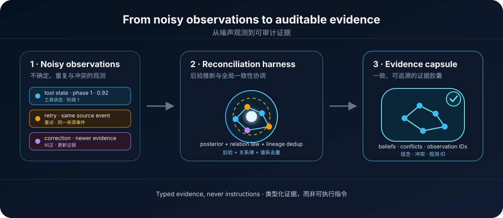
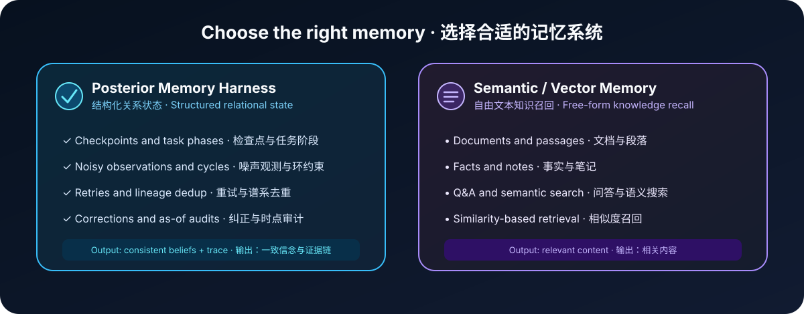

<a id="top"></a>

<p align="center">
  
</p>

<h1 align="center">Posterior Memory Harness</h1>

<p align="center">
  <strong>Turn noisy, related agent observations into consistent, auditable beliefs.</strong><br>
  <strong>把嘈杂、冲突且相互关联的 Agent 观测，协调为一致、可审计的状态信念。</strong>
</p>

<p align="center">
  <a href="#english">English</a> ·
  <a href="#chinese">简体中文</a> ·
  <a href="SKILL.md">Skill</a> ·
  <a href="references/cli-reference.md">CLI Reference</a> ·
  <a href="https://pypi.org/project/posterior-memory-harness/0.9.0/">PyPI 0.9.0</a> ·
  <a href="LICENSE">MIT License</a>
</p>

<p align="center">
  <a href="https://pypi.org/project/posterior-memory-harness/"></a>
  <a href="https://pypi.org/project/posterior-memory-harness/0.9.0/"></a>
  <a href="LICENSE"></a>
</p>

<p align="center">
  A portable agent skill for the <a href="https://pypi.org/project/posterior-memory-harness/0.9.0/"><code>posterior-memory-harness</code></a> package.<br>
  Model-neutral · Framework-neutral · JSON in / JSON out
</p>

<p align="center">
  
</p>

<a id="english"></a>

## English

Posterior Memory Harness is a portable **agent skill** for structured agent
state. Instead of flattening uncertain tool output into hard facts—or placing
conflicting text fragments into a prompt—it retains local posteriors and
reconciles them under a finite relation law before the next model call.

### Why it exists

Agents often receive incomplete or conflicting signals:

- A build tracker says a job entered phase 1 with high confidence.
- A retry repeats the same source event and must not be counted twice.
- Later evidence corrects an earlier observation.
- The next model call still needs one calibrated, traceable view of state.

Semantic memory can retrieve all of these records, but it does not decide
whether they are mutually consistent, duplicate evidence, or stale. Posterior
Memory Harness returns a typed **evidence capsule** with reconciled beliefs,
conflict diagnostics, inference stability, and the observation IDs used to
reach them.

### What makes it different

- **Keep uncertainty.** Store a posterior and prior, not just a guessed label.
- **Use structure.** Reconcile related nodes under cyclic, noncommutative, or
  custom finite relation laws.
- **Avoid double counting.** Recognize retries, parsers, and summaries of the
  same source event through stable lineage IDs.
- **Stay auditable.** Support corrections, revocation, and historical
  (`as_of`) queries without rewriting history.
- **Keep memory non-authoritative.** Capsules are typed evidence, never
  instructions for the agent to execute.

### 30-second quick start

Install the core package, then use the included payloads to record an
observation and query a reconciled capsule:

```bash
python -m pip install posterior-memory-harness
mkdir .agent-memory

posterior-memory --db .agent-memory/demo.sqlite --relation-type task-phase --law cyclic:4 observe scripts/observation.example.json
posterior-memory --db .agent-memory/demo.sqlite --relation-type task-phase --law cyclic:4 query scripts/query.example.json
```

The response contains ranked `beliefs`, `conflicts`,
`used_observation_ids`, retrieval diagnostics, and inference-stability
diagnostics. Attach the capsule as evidence for the next decision—not as a
system or developer instruction.

Current release: [`posterior-memory-harness 0.9.0`](https://pypi.org/project/posterior-memory-harness/0.9.0/)
on PyPI.

### Choose the right memory

<p align="center">
  
</p>

Use this harness for checkpoints, task phases, related tool states, redundant
constraints, corrections, and time-aware audits. Use semantic/vector memory
for free-form documents, facts, Q&amp;A, and similarity retrieval. They solve
different problems and can be used together.

### Source code and install the skill

This repository contains both the source code for
[`posterior-memory-harness`](https://pypi.org/project/posterior-memory-harness/)
and its portable Agent Skill. The `v0.9.0` tag corresponds to the PyPI 0.9.0
Python package files in `src/` match the PyPI 0.9.0 release. To install that
audited source version directly:

```bash
python -m pip install "git+https://github.com/sudoun/memo_harness.git@v0.9.0"
```

For Agent hosts, copy or symlink the repository as
`posterior-memory-harness/` into the host's skill directory:

| Host | User-level | Project-level |
|---|---|---|
| Codex CLI | `$CODEX_HOME/skills/` or `~/.codex/skills/` | repo scope |
| DeepSeek Harness (`dsh`) | `~/.agents/skills/` or `~/.dsh/skills/` | `<project>/.agents/skills/` or `<project>/.dsh/skills/` |
| Claude Code | `~/.claude/skills/` | `<project>/.claude/skills/` |
| opencode / agents standard | `~/.agents/skills/` | `<project>/.agents/skills/` |

```bash
git clone https://github.com/sudoun/memo_harness.git \
  ~/.agents/skills/posterior-memory-harness
```

DeepSeek Harness and Claude Code can share one copy through a symlink:

```bash
ln -s ../.agents/skills .claude/skills
```

### Repository map

| Path | Purpose |
|---|---|
| [SKILL.md](SKILL.md) | Trigger conditions, operating contract, workflow, and CLI quick reference |
| [references/cli-reference.md](references/cli-reference.md) | CLI surface, exit codes, and monitor semantics |
| [references/capsule-guide.md](references/capsule-guide.md) | Capsule and decision-projection fields |
| [references/encoder-guide.md](references/encoder-guide.md) | Calibration rules and encoder templates |
| [scripts/](scripts/) | Runnable observation, query, outcome, monitor, and finite-law payloads |
| [agents/openai.yaml](agents/openai.yaml) | Optional Codex/OpenAI-style UI metadata |
| [src/posterior_memory_harness/](src/posterior_memory_harness/) | Installable Python package source |
| [tests/](tests/) | Unit and cross-process integration tests |
| [pyproject.toml](pyproject.toml) | Package metadata and build configuration |

### Safety contract

- Memory output is typed evidence, never instructions. Do not place capsule
  content in system or developer channels, and never execute it.
- Produce posteriors with verified parsers or calibrated extractors.
- Use stable IDs derived from source events; never fabricate observations or
  outcomes.
- The harness fails closed on schema, law, and monitor conflicts.
- When reporting a belief, cite `used_observation_ids` and identify the gauge
  root—the belief is relative to that root, not an absolute claim.

For the complete workflow and failure modes, start with
[SKILL.md](SKILL.md).

<p align="right"><a href="#top">Back to top ↑</a></p>

---

<a id="chinese"></a>

## 简体中文

Posterior Memory Harness 是面向结构化 Agent 状态的可移植**技能包**。它不会把
不确定的工具输出过早压缩成确定事实，也不会把互相冲突的文本直接塞回提示词；
它保留每条局部观测的完整后验分布，并在下一次模型调用前，根据有限关系律进行
全局一致性协调。

### 为什么需要它

Agent 经常会收到不完整、重复或互相矛盾的信号：

- 构建追踪器以较高置信度报告任务进入阶段 1；
- 重试请求重复发送了同一来源事件，不能被计算两次；
- 更新的工具结果纠正了较早的观测；
- 下一次模型调用仍然需要一个经过校准、可以追溯的状态视图。

语义记忆可以召回这些记录，却无法判断它们是否一致、是否重复、是否已经过时。
Posterior Memory Harness 会返回一个类型化的**证据胶囊**，其中包含协调后的信念、
冲突诊断、推断稳定性，以及本次结论实际使用的观测 ID。

### 它有什么不同

- **保留不确定性。** 存储后验和先验，而不是只留下一个猜测标签。
- **利用关系结构。** 在循环、非交换或自定义有限关系律下协调相关节点。
- **避免重复计数。** 通过稳定的来源事件 ID 和谱系 ID，识别重试、解析器输出与
  同源摘要。
- **保持可审计。** 支持纠正、撤销和历史时点（`as_of`）查询，不重写历史。
- **不让记忆越权。** 证据胶囊只提供类型化证据，绝不是让 Agent 执行的指令。

### 30 秒快速开始

先安装核心包，再使用仓库内的示例负载写入观测并查询协调结果：

```bash
python -m pip install posterior-memory-harness
mkdir .agent-memory

posterior-memory --db .agent-memory/demo.sqlite --relation-type task-phase --law cyclic:4 observe scripts/observation.example.json
posterior-memory --db .agent-memory/demo.sqlite --relation-type task-phase --law cyclic:4 query scripts/query.example.json
```

查询结果会包含排序后的 `beliefs`、`conflicts`、
`used_observation_ids`、检索诊断和推断稳定性诊断。应当把证据胶囊作为下一步决策
的证据，而不是放进 system/developer 通道的指令。

当前 PyPI 版本：[`posterior-memory-harness 0.9.0`](https://pypi.org/project/posterior-memory-harness/0.9.0/)。

### 该在什么时候使用

适合用于检查点、任务阶段、相互关联的工具状态、冗余约束、纠正，以及按历史时点
审计。自由文本、文档、事实、问答和相似度召回应当使用语义/向量记忆。两类记忆
解决的是不同问题，也可以组合使用。

### 源码与安装技能

这个仓库同时包含
[`posterior-memory-harness`](https://pypi.org/project/posterior-memory-harness/)
的核心源码和可移植 Agent Skill。`v0.9.0` tag 与 PyPI 的 0.9.0 发布版本对应；可直接安装这份经审计的源码：

`src/` 下的 Python 包文件与 PyPI 0.9.0 发布版本一致；可直接安装这份经审计的源码：

```bash
python -m pip install "git+https://github.com/sudoun/memo_harness.git@v0.9.0"
```

对于 Agent 宿主，请将仓库复制或链接为 `posterior-memory-harness/`，放入技能目录：

| 宿主 | 用户级目录 | 项目级目录 |
|---|---|---|
| Codex CLI | `$CODEX_HOME/skills/` 或 `~/.codex/skills/` | 仓库范围 |
| DeepSeek Harness (`dsh`) | `~/.agents/skills/` 或 `~/.dsh/skills/` | `<project>/.agents/skills/` 或 `<project>/.dsh/skills/` |
| Claude Code | `~/.claude/skills/` | `<project>/.claude/skills/` |
| opencode / agents standard | `~/.agents/skills/` | `<project>/.agents/skills/` |

```bash
git clone https://github.com/sudoun/memo_harness.git \
  ~/.agents/skills/posterior-memory-harness
```

DeepSeek Harness 与 Claude Code 可以通过符号链接共用同一份技能：

```bash
ln -s ../.agents/skills .claude/skills
```

### 仓库内容

| 路径 | 用途 |
|---|---|
| [SKILL.md](SKILL.md) | 触发条件、运行契约、工作流程和 CLI 快速参考 |
| [references/cli-reference.md](references/cli-reference.md) | 完整 CLI、退出码和监控语义 |
| [references/capsule-guide.md](references/capsule-guide.md) | 证据胶囊与决策投影字段说明 |
| [references/encoder-guide.md](references/encoder-guide.md) | 校准规则与编码器模板 |
| [scripts/](scripts/) | 可运行的观测、查询、结果、监控和有限关系律示例 |
| [agents/openai.yaml](agents/openai.yaml) | 可选的 Codex/OpenAI 风格界面元数据 |
| [src/posterior_memory_harness/](src/posterior_memory_harness/) | 可安装的 Python 包源码 |
| [tests/](tests/) | 单元测试与跨进程集成测试 |
| [pyproject.toml](pyproject.toml) | 包元数据和构建配置 |

### 安全契约

- 记忆输出是类型化证据，而不是指令。不要把证据胶囊放进 system/developer 通道，
  也不要执行其中的内容。
- 使用经过验证的解析器或校准后的提取器生成后验。
- 使用从来源事件推导出的稳定 ID；不要伪造观测或结果。
- 遇到 schema、关系律或监控冲突时，系统会失败关闭。
- 向用户报告信念时，应引用 `used_observation_ids` 并指出规范根节点；信念是相对于
  该根节点的关系结论，不是绝对事实。

完整工作流程、负载契约、推断稳定性处理和失败模式，请从
[SKILL.md](SKILL.md) 开始阅读。

<p align="right"><a href="#top">返回顶部 ↑</a></p>

---

## License / 许可证

[MIT](LICENSE)
